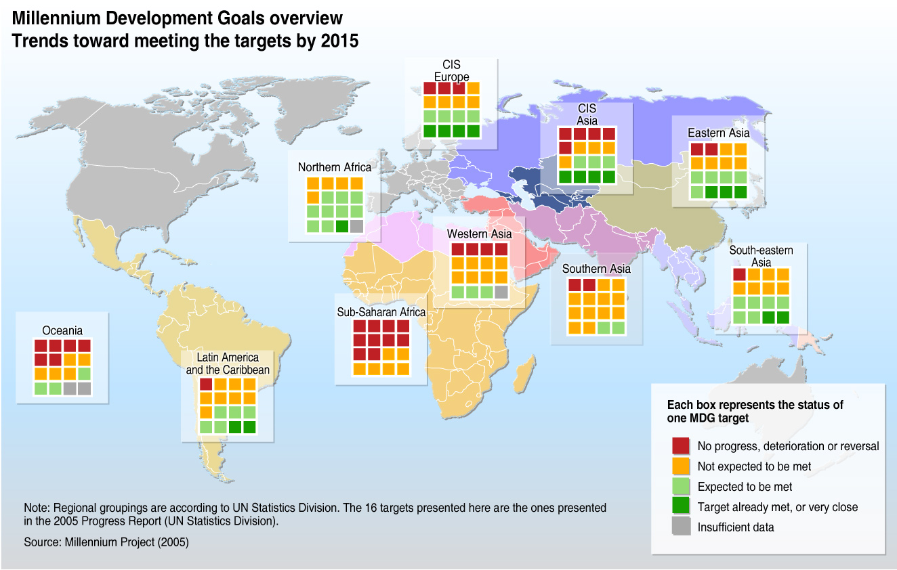

UN_Millennium_Development
=========================

A journey of a thousand miles begins with a single step, but starting this week we can march a thousand days forward into a new future. On June 5th, the world will reach a vital moment in history's largest and most successful anti-poverty push -- the 1,000-day mark before the target date to achieve the Millennium Development Goals. The project aims to tell the MDGs story from a more data-driven perspective.

